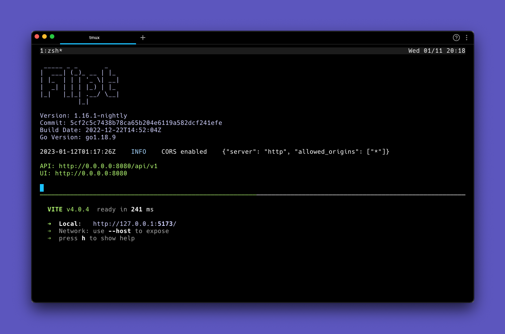

# Flipt UI

[](https://github.com/flipt-io/flipt-ui/actions/workflows/build.yml)


This repository contains the UI for [Flipt](https://github.com/flipt-io/flipt) as of v0.17.0.

It is built with [React](https://reactjs.org/), [Tailwind CSS](https://tailwindcss.com/) and [TypeScript](https://www.typescriptlang.org/).

## Packaging

This repository is part of the larger Flipt build process which we are still working on improving.

Currently, it get's pulled in during Flipt builds and is not published as a standalone package.

## Building

The UI is built using [Vite](https://vitejs.dev/), which is a build tool that leverages [ESM](https://developer.mozilla.org/en-US/docs/Web/JavaScript/Guide/Modules) and [Rollup](https://rollupjs.org/guide/en/) under the hood.

To build a production version of the UI, run:

```bash
npm run build
```

## Development

We're actively working on making the development process easier, so stay tuned! If you have any suggestions, please [open an issue](https://github.com/flipt-io/flipt-ui/issues/new) or chat with us in our [Discord server](https://www.flipt.io/discord).

### Prerequisites

- [Node.js](https://nodejs.org/en/) (v16 or later)
- [Docker](https://www.docker.com/products/docker-desktop) (optional but recommended)

### Flipt API

You'll need to run the Flipt API backend locally to develop the UI.

The simplest way to do this is to use the [Flipt Docker image](https://hub.docker.com/r/flipt/flipt). See the [documentation](https://www.flipt.io/docs/installation#run-the-image) for more details.

**Note:** It's recommended to use the `latest` tag for the Docker image if you want the latest stable release, otherwise you can use the `nightly` tag for the most up to date code changes.

```bash
docker run -d \
    -p 8080:8080 \
    -p 9000:9000 \
    -e FLIPT_CORS_ENABLED=true \
    -v $HOME/flipt:/var/opt/flipt \
    flipt/flipt:nightly
```

**Note:** CORS must be enabled since the UI runs on a different port than the API in development mode.

### Install Dependencies

```bash
npm install
```

### Running the UI



Run the development server in a separate terminal:

```bash
npm run dev
# or
yarn dev
```

Open [http://localhost:5137](http://localhost:5137) with your browser to see the result.

## Contributing

We would love your help! Before submitting a PR, please read over the [Contributing](.github/contributing.md) guide.

No contribution is too small, whether it be bug reports/fixes, feature requests, documentation updates, or anything else that can help drive the project forward.

### Conventional Commits

We use [Conventional Commits](https://www.conventionalcommits.org/en/v1.0.0/) for commit messages. Please adhere to this specification when contributing.
